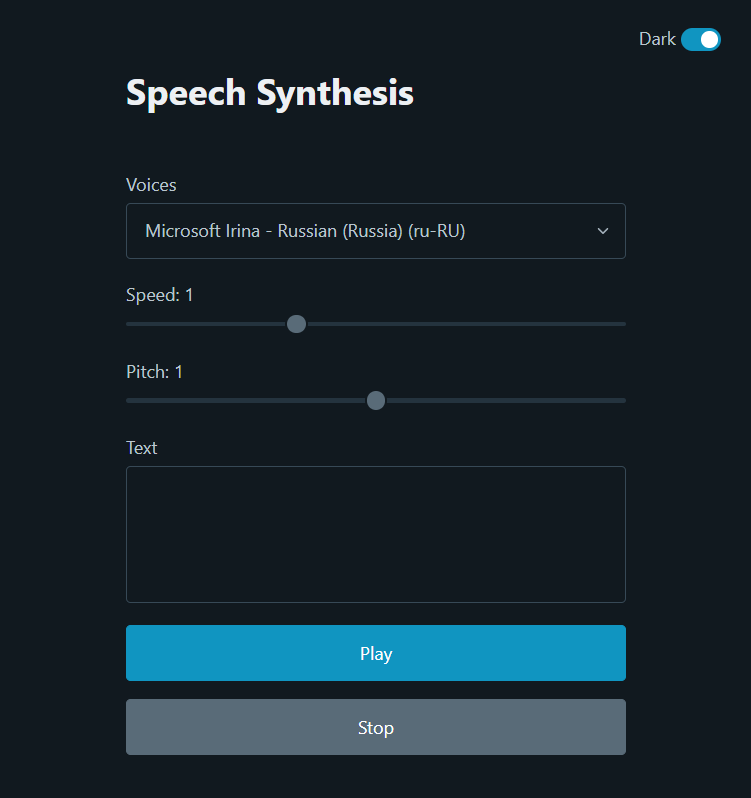
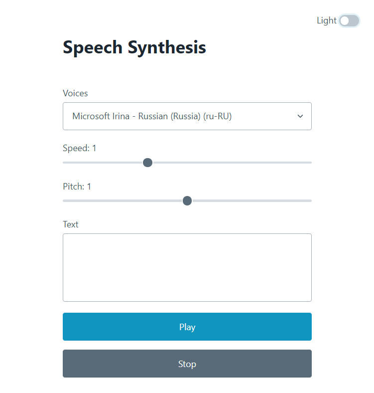

# Speech Synthesis

A small text-to-speech app.

## Features

- Text reading
- Voice selection
- Adjusting voice speed and pitch before playback
- Switching the color theme
- Responsive layout

### Dark theme:

### Light theme:

This project was written
with [Web Speech API](https://developer.mozilla.org/en-US/docs/Web/API/Web_Speech_API)
and [Pico.css](https://picocss.com/).
